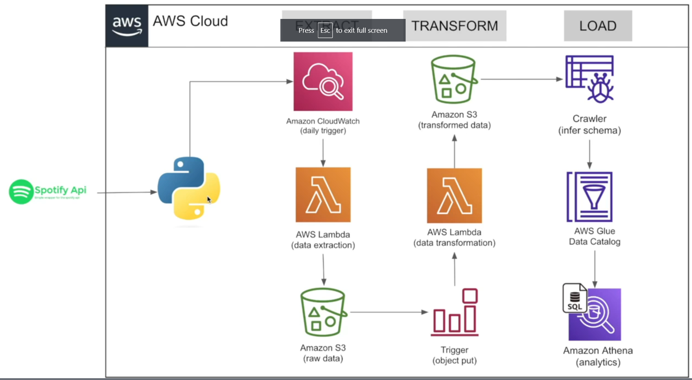

# Spotify-ETL-End-to-End-Data-Engineering-Project

### Introduction

In this project , we will build an ETL(Extract , Transform,Load) pipeline using the Apotify API on AWS. The pipeline will retrieve data from the Spotify API , transform it to a desired format , and load it into AWS Glue Data Catalog

### Architecture 



### About Dataset/API : 
This API contains information about music artist, album and songs. - [Spotify API](https://developer.spotify.com/documentation/web-api)

### Services Used :

1. **S3 (Simple Storage Service)** : Amazon S3 is highly scalable object storage service that can store and retrieve any amount of data from anywhere on the web. It is commonly used to store and disrtibute large  media files, data backups, and static website files.

2. **AWS Lambda** : AWS lambda is a serverless computing service that lets you run your cide without managing servers. You can use Lambda to run code in response to evnts like changes in S3, DynamoDB, ot other AWS Services.

3. **AWS Cloud Watch** : AWS Cloud Watch is a monitoring service for AWS resources and the application you run on them. You can use CoudWatch to collect and track metrics, collect and monitor log files, and set alarms.

4. **Glue Crawler** : AWS Glue Crawler is a fully managed service that automatically crawls your data sources, identifies data formats and infers schemas to create an AWS Data Catalog 

5. **Data Catalog** : AWS Glue Data Catalog is fully managed metadata repository that makes it easy to discover and manage data in AWS. You can use the Glue Data catalog with other AWS services, Such as Athena

6. **Analytics Query** : Amazon Athena is an interactive query service that makes it easy to analyze data in Amazon S3 using standard SQL. You can use Athena to analyze data in your Glue Data Catalog or in other S3 buckets.


### Install Packages

```
pip install pandas 
pip install spotipy

```

### Project Execution Flow

Extract data from API -> Lambda Trigger (every 1 day ) -> Run Extract Code -> Store Raw Data -> Trigger Transform Function -> Transform data and load it-> Query using Athena
